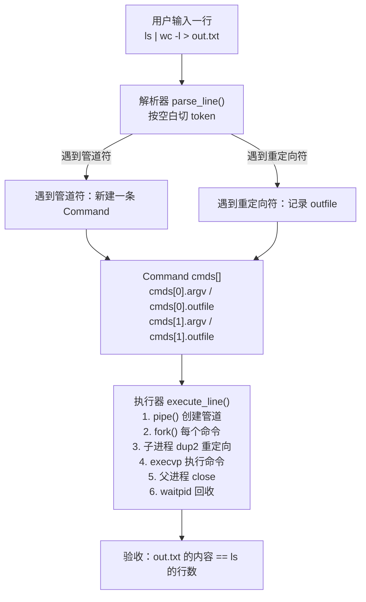
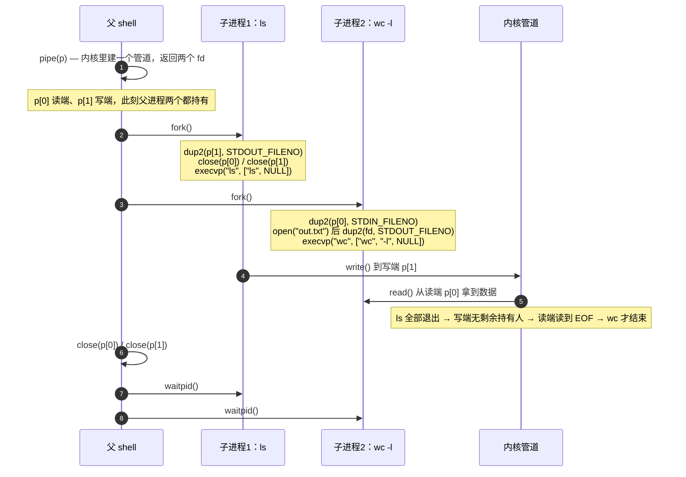

# 01 · mini shell 概念

> **这张图是坐标系**：TASKS.md 的验收命令 `ls | wc -l > out.txt` 里出现的每个名词
> （token / `Command` / `cmds[]` / `pipe` / `fork` / `dup2` / `execvp` / `waitpid`）都能在图上找到位置。
>
> **读法**：§1 总体结构 → §2 解析结果 → §3 进程与 fd 的诞生顺序 → §4 数据流 → §5 fd 表 → §6 关键点 → §7 自查。
>
> **格式约定**：
>
> - 概念图 / 流程图 / 时序图 → **Mermaid** 代码块（语言标注 `mermaid`）。GitHub 网页、VSCode 的 Markdown
>   预览、Chirpy 博客（front matter 加 `mermaid: true`）都能直接渲染；同时它仍是纯文本，能 diff、能 review、能进版本管理。
> - 表格 → Markdown 表格；命令行与结构体 → 带语言标注的代码块（`bash`、`c`）。
> - 不再手绘 ASCII 框图：中文是双宽字符，用 `+` `-` `|` 拼的框永远对不齐，改一个字就得整块重排。

## 1. 总体结构



一次输入只走三个阶段：**切词 → 填 `cmds[]` → 逐个 fork/exec**。
`parse_line` 只认三种情况：普通 token（追加进当前命令的 `argv`）、`|`（开一条新命令）、`>`（记当前命令的 `outfile`）。

## 2. 验收命令的解析结果

```bash
ls | wc -l > out.txt
```

| 下标 | `argv` | `outfile` |
|---|---|---|
| `cmds[0]` | `["ls", NULL]` | `NULL` |
| `cmds[1]` | `["wc", "-l", NULL]` | `"out.txt"` |

`outfile` 属于**它前面那条命令**：`> out.txt` 写在 `wc -l` 后面，所以挂在 `cmds[1]` 上——
重定向的是 `wc` 的 stdout，不是 `ls` 的。

## 3. 进程与 fd 的诞生顺序

时序图按代码顺序画，但 fork 之后父子进程是**并行**往下走的，父子各持有一份 fd 表副本。



「父进程先 close 两个管道端」是必须的：父进程也持有 `p[1]`，不关掉它，即使 `ls` 退出，读端也等不到 EOF，`wc` 会一直挂着。

## 4. 数据流


## 5. 文件描述符视角

| 进程 | fd0 | fd1 | fd2 |
|---|---|---|---|
| `ls` 子进程 | 终端 | `p[1]` 写端 | 终端 |
| `wc` 子进程 | `p[0]` 读端 | `out.txt` | 终端 |
| 父 shell | 终端 | 终端 | 终端 |

## 6. 关键点

- `|` 的本质：前一个命令的 stdout 接到管道写端，后一个命令的 stdin 接到管道读端。
- `>` 的本质：在子进程里 `open()` 文件，然后 `dup2(fd, STDOUT_FILENO)`。
- `execvp` 会替换子进程映像，执行外部命令。
- 父进程必须关闭所有管道端，子进程也要关闭自己不用的那一端，否则读端可能等不到 EOF。
- `waitpid` 用来等待子进程结束并回收资源。

## 7. 自查

1. fork 之后，父进程和两个子进程各自持有哪些 fd 端？（对照 §5 的表）
2. 为什么 `wc -l` 必须等到 `ls` 结束、并且所有写端都被关闭，才会拿到 EOF？
3. 如果父进程忘了 `close(p[1])`，`ls | wc -l` 会停在哪一步？
4. 为什么 `> out.txt` 的重定向要放在子进程里做，而不是在解析阶段就 `open()`？
